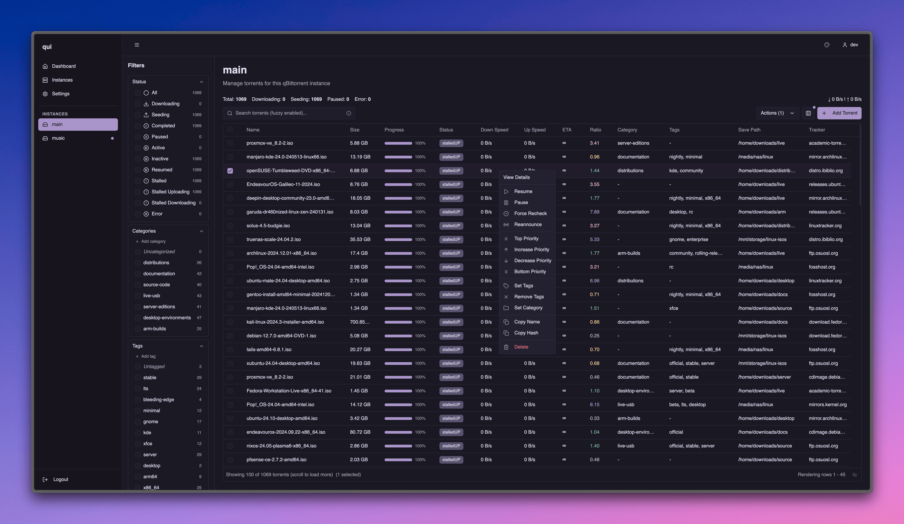

# qui

A fast, modern web interface for qBittorrent. Manage multiple qBittorrent instances from a single, lightweight application.

<div align="center">
  
</div>

## Features

- **Single Binary**: No dependencies, just download and run
- **Multi-Instance Support**: Manage all your qBittorrent instances from one place
- **Fast & Responsive**: Optimized for performance with large torrent collections
- **Real-time Updates**: Live torrent progress and status updates
- **Clean Interface**: Modern UI built with React and shadcn/ui components
- **Multiple Themes**: Choose from various color themes
- **Base URL Support**: Serve from a subdirectory (e.g., `/qui/`) for reverse proxy setups

## Installation

### Download

Download the latest release for your platform from the [releases page](https://github.com/autobrr/qui/releases).

### Run

```bash
# Make it executable (Linux/macOS)
chmod +x qui

# Run
./qui
```

The web interface will be available at http://localhost:8080

### First Setup

1. Open your browser to http://localhost:8080
2. Create your admin account
3. Add your qBittorrent instance(s)
4. Start managing your torrents

## Configuration

Configuration is stored in `config.toml` (created on first run). You can also use environment variables:

```bash
# Server
QUI__HOST=0.0.0.0        # Listen address
QUI__PORT=8080           # Port number
QUI__BASE_URL=/qui/      # Optional: serve from subdirectory

# Security
QUI__SESSION_SECRET=...  # Auto-generated if not set

# Logging
QUI__LOG_LEVEL=INFO      # Options: ERROR, DEBUG, INFO, WARN, TRACE
```

## API

### Documentation

Interactive API documentation is available at `/api/docs` using Swagger UI. You can explore all endpoints, view request/response schemas, and test API calls directly from your browser.

### API Keys

API keys allow programmatic access to qui without using session cookies. Create and manage them in Settings → API Keys.

Include your API key in the `X-API-Key` header:

```bash
curl -H "X-API-Key: YOUR_API_KEY_HERE" \
  http://localhost:8080/api/instances
```

**Security Notes:**
- API keys are shown only once when created - save them securely
- Each key can be individually revoked without affecting others
- Keys have the same permissions as the main user account

## Docker

```bash
# Using Docker Compose
docker compose up -d

# Or standalone
docker run -d \
  -p 8080:8080 \
  -v $(pwd)/config:/config \
  ghcr.io/autobrr/qui:latest
```

## Base URL Configuration

If you need to serve qui from a subdirectory (e.g., `https://example.com/qui/`), you can configure the base URL:

### Using Environment Variable
```bash
QUI__BASE_URL=/qui/ ./qui
```

### Using Configuration File
Edit your `config.toml`:
```toml
baseUrl = "/qui/"
```

### With Nginx Reverse Proxy
```nginx
# Redirect /qui to /qui/ for proper SPA routing
location = /qui {
    return 301 /qui/;
}

location /qui/ {
    proxy_pass http://localhost:8080/qui/;
    proxy_set_header Host $host;
    proxy_set_header X-Real-IP $remote_addr;
    proxy_set_header X-Forwarded-For $proxy_add_x_forwarded_for;
    proxy_set_header X-Forwarded-Proto $scheme;
}
```

## Development

### Quick Start for Developers

```bash
# Requirements: Go 1.24+ and Node.js 22+

# Run both frontend and backend in dev mode
make dev

# Run backend only (with hot reload)
make dev-backend

# Run frontend only  
make dev-frontend
```

## Features in Detail

### Instance Management
- Add unlimited qBittorrent instances
- Health monitoring and auto-reconnection
- Secure credential storage

### Torrent Management
- Bulk operations (pause, resume, delete)
- Advanced filtering and search
- Category and tag management
- Real-time progress tracking

### Performance
- Efficient data sync for large collections
- Minimal memory footprint
- Fast search and filtering
- Responsive UI with virtual scrolling

## Contributing

Contributions are welcome! Please feel free to submit a Pull Request.

## License

MIT